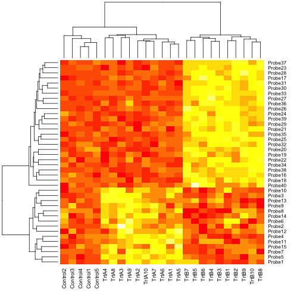
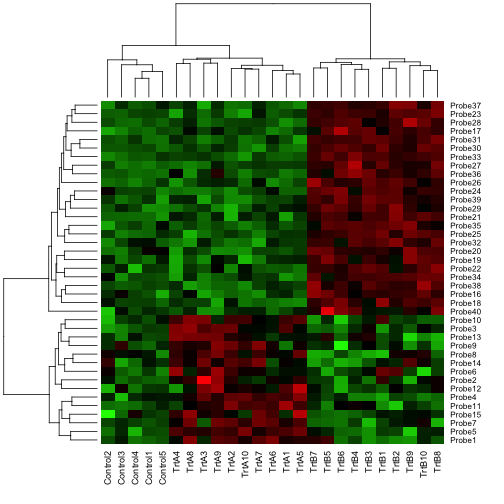
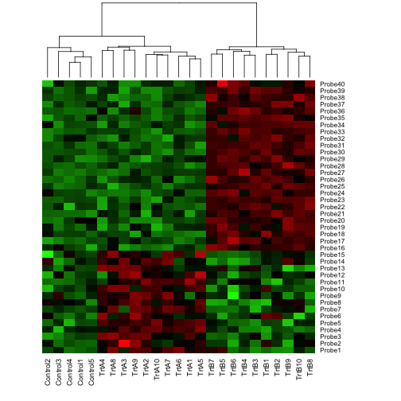

## Example data set


```r
set.seed(100)
data <- matrix(rnorm(1000), 40, 25)
data[1:15, seq(6, 25, 2)] = data[1:15, seq(6, 25, 2)] + 2
data[16:40, seq(7, 25, 2)] = data[16:40, seq(7, 25, 2)] + 4
colnames(data) <- c(paste("Control", 1:5, sep = ""), paste(c("TrtA", "TrtB"),
                                                           rep(1:10, each = 2), sep = ""))
rownames(data) <- paste("Probe", 1:40, sep = "")
```

---

## Default display

```r
heatmap(data)
```

 

---


## Change color to Green-Black-Red


```r
hmcols <- colorRampPalette(c("green", "black", "red"))(256)
heatmap(data,col=hmcols )
```

 

---

## No dendrogram of rows


```r
heatmap(data,col=hmcols, Rowv = NA )
```

 


